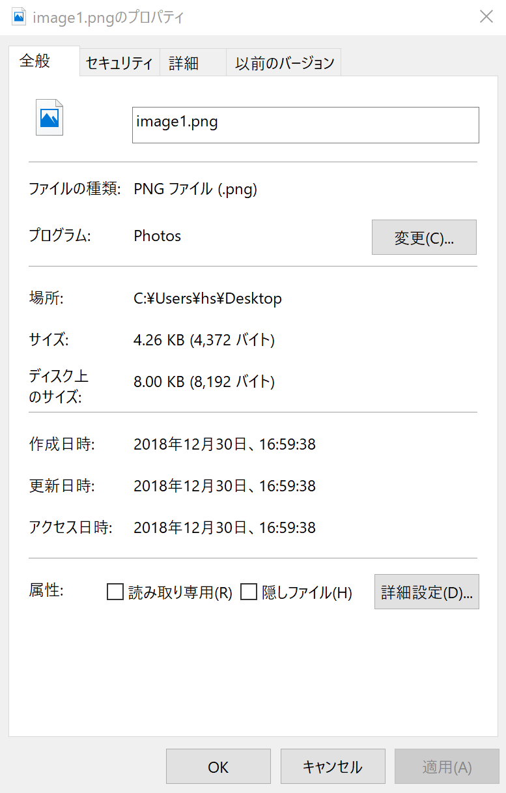

# [第11回：ファイル入出力](@id ch11)

## ▶ 画像と画像ファイル

### ▶ 描画寸法の調整

`PyPlot` パッケージで描くグラフの寸法を調整する方法を紹介する．

描画範囲を指定するには，命令 `plt.figure(figsize=(x,y))` を用いる．
`x` と `y` には，横 `x` と 縦 `y` の寸法を，インチ単位で指定する． `1 inch = 25.4 mm` である．

以下の例では，描画範囲を，横と縦をどちらも 80 mm に変更する．


```@example ch000
using PyPlot
plt.figure(figsize = (80.0 / 25.4, 80.0 / 25.4))

plt.plot([0, 1, 2])
plt.plot([2, 1, 0])
plt.savefig("ch11-plot1.svg"); nothing; #hide
plt.close("all") #hide
```


軸の位置，あるいは，軸の周囲の余白（margin）の割合を指定するのは少し手間がいる．
まず，関数 `plt.figure()` を用いて `fig` オブジェクトを得てから，
`fig` オブジェクトに対して `fig[:subplots_adjust]()` を適用する．

`fig[:subplots_adjust]()` では，
キーワード引数 `left` , `right` , `top` , `bottom` を用いる．

横方向では，`left=` で左軸の位置（割合）を，`right=`で，右軸の位置（割合）を指定する．
この指定では，描画範囲の左端を `0` ,右端を `1` とする．

縦方向では，`bottom=` で下軸の位置（割合）を，`top=` で，上軸の位置（割合）を指定する．
この指定では，描画範囲の下端を `0` ,上端を `1` とする．

下の例では `left=0.2, right=0.9, bottom=0.2, top=0.9` としたので，
左と下の軸を各々の端から `20 %` に，右と上の軸を各々の端から `10 %` に配置する．

```@example ch000
using PyPlot
plt.subplots_adjust(left = 0.2, right = 0.9, bottom = 0.2, top = 0.9)
# ax=fig.add_subplt.plot(111)
fig, ax = plt.subplots()
ax.plot([0, 1, 2])
ax.plot([2, 1, 0])
plt.savefig("ch11-plot2.svg"); nothing; #hide
plt.close("all") #hide
```


描画寸法の指定と，余白の指定を組み合わせると，左右または上下の軸の間隔を寸法で指定できる．

下の例では，左右および上下の軸の間隔を `80 mm` と指定する．

```@example ch000
m_left = 0.2;
m_right = 0.9;
m_bottom = 0.2;
m_top = 0.9;
fx = 80.0 / (m_right - m_left)
fy = 80.0 / (m_top - m_bottom)
using PyPlot
plt.figure(figsize = (fx / 25.4, fy / 25.4))
plt.subplots_adjust(
   left = m_left,
   right = m_right,
   bottom = m_bottom,
   top = m_top,
)
fig, ax = plt.subplots()

ax.plot([0, 1, 2])
ax.plot([2, 1, 0])
ax.set_xlim(0, 2)
ax.set_ylim(0, 2)
plt.savefig("ch11-plot3.svg"); nothing; #hide
plt.close("all") #hide
```


### ▶ ファイル名・パス名・拡張子

Windows, MacOS, Linux など，多くの「オペレーティング・システム（OS; Operating System） 」では，
「フォルダ（folder）」あるいは「ディレクトリ（directory）」と呼ばれる階層構造の中に，ファイルを格納する．

ファイルが格納されたフォルダーは，「ファイルの属性」で調べることができる．

Windows10 のデスクトップ・アプリケーション「ペイント」で適当な絵を描いて，PNG形式で `image1.png` という名前でデスクトップに保存しよう．

ファイル `image1.png` をデスクトップ上で選んで右クリック，「プロパティ」メニューを選ぶと，そのファイルの属性（プロパティ，property）が表示される．

「場所」という属性に，このファイルが格納されたフォルダが表示される．
Windows 10 では `c:¥Users¥hs¥Desktop` というフォルダ名は，ユーザ名 `hs` のデスクトップである．
このファイルの完全な名前（「絶対パス absolute path」; あるいは「フルパス full path」）は  `c:¥Users¥hs¥Desktop¥image1.png` である．

このファイルの名前は，`.png` で終わっている．この部分は，ファイルの種類を示しており，拡張子と呼ばれる．




!!! note
    デスクトップやエクスプローラでは，いくつかの拡張子が表示されない設定になっている場合がある．
    拡張子を表示するには，次のようにする．

    * 「コントローラ・パネル」から「エクスプローラ・オプション」を開く
    * 「表示」タブを選択
    * 「登録されている拡張子は表示しない」のチェックを外す
    * 下の「OK」ボタンを押すと，この設定が適用される

    


### ▶ 画像ファイルの保存

関数 `plt.savefig(fn)` は，`PyPlot` パッケージで描いた直近のグラフをファイル名 `fn` として保存する命令である．

以下では，`ch11-image1.png` という名前でファイルが作成・保存する．
拡張子 `.png` の指定で，PNG画像ファイルが作成される．

同じ名前のファイル名が存在しても警告されず，上書きされる．

```@example ch000
using PyPlot
plt.figure(figsize = (80.0 / 25.4, 80.0 / 25.4))

plt.plot([0, 1, 2])
plt.plot([2, 1, 0])
plt.savefig("ch11-image1.png")
plt.close("all") #hide
```


!!! note
    「相対パスと絶対パス」

    フォルダあるいはディレクトリの区切りに使われる文字は OS毎に異なるが，
    Julia言語では，OSに依らずスラッシュ文字 `/` で区切ることになっている．

    上の例のように，フォルダを指定せずに，ファイル名のみ指定する場合を「相対パス（relative path）」による指定という．

    相対パスでは，現在の作業フォルダ（working folder,あるいは，カレント・フォルダ，current folder）の下に，ファイルが保存される．

    現在の作業フォルダは，関数 `Base.pwd()` で得られる（print working directory）．
    ```@repl ch000
    Base.pwd()  # 各自異なる場合がある
    ```

    カレント・フォルダを変更するには，関数 `Base.cd()` を用いる（change working directory）．

    ユーザ名 `hs` のデスクトップは，Windows 10 や MacOS のどちらでも `/Users/hs/Desktop` というフォルダ名であるので，
    ユーザ名 `hs` のユーザが，作業フォルダーをデスクトップに変更するには，
    ```@repl ch000
    Base.cd("/Users/hs/Desktop")  # 各自の環境に応じて書き換えること
    ```
    とする．

    これに対して，`plt.savefig( "/Users/hs/Desktop/ch11-image1.png" )` のように，
    「絶対パス（absolute path）」でファイル名を指定してもよい．

!!! note
    「保守的なファイル名を使おう」

    ファイル名やフォルダー名（ディレクトリ名）に用いられる文字の種類は，
    OS やネットワーク・システムにより異なる．
    ファイル名の「文字化け」を避けるために，ファイル名は，以下のように選んでおくことを勧める．
    * ファイル名を，半角の英数字およびマイナス記号 `-` のみで構成する．拡張子の直前の文字として ピリオド `.` を用いる．
    * 拡張子の前に半角のピリオド `.` を用いてもよい．
    * 半角の英大文字と英小文字は区別されないとする．


### ▶ 画像ファイルの種類

画像ファイルの形式は，大きく分けてビットマップ画像とベクトル（またはベクタ）画像に大別できる．

ビットマップ画像（bitmap image）は，画素（pixel）の集合として画像を格納するファイル形式である．
* JPEGファイル（拡張子 JPG）は，写真画像によく用いられる．圧縮率は高いが，元の画像を復元しない場合がある．
* GIFファイル．256 色までの画像を表現できる．複数の画像を格納でき，アニメーションを表示できる．
* PNGファイル．より多数の色を表現できる．元の画像に劣化がなく復元できる．

「ベクトル画像（vector image）」は，直線や円などの図形の組合せとして画像を格納するファイル形式である．
* EPS（Encapsulated PostScript）
* PDF（Portable Document Format）
* SVG（Scalable Vector Graphics）
* WMF（Windows Metafile）

### ▶ 画像ファイルの保存オプション

関数 `plt.savefig(fn)` には，いくつかのキーワード引数がある．

* `format="..."` : 画像ファイル形式を指定する（ファイル拡張子よりも，こちらの引数が優先される）
* `dpi=数字` : 画像の解像度を，数字で指定する
* `transparent=true` : 白背景を透明にする

```@example ch000
using PyPlot
plt.figure(figsize = (80.0 / 25.4, 80.0 / 25.4))

plt.plot([0, 1, 2])
plt.plot([2, 1, 0])
plt.savefig("ch11-image2.png", format = "png", dpi = 300, transparent = true)
plt.close("all") #hide
```


!!! note
    上の画像ファイル `ch11-image2.png` は，一つ上の画像ファイル `ch11-image2.png`  と同じ内容であるが，Webブラウザ上では，前者の方が大きく見える．これは，Webブラウザ上では，「画素（ピクセル，pixel）」の単位でしか，画像の寸法を指定できないためである．

!!! note
    dpi（dots per inch）は，画像の解像度であり，1インチ内の画素数を示す．
    * 粗い Webページの画像は 100 dpi 程度である．
    * 低品位・中品位の印刷物の画像は 150 dpi 程度である．
    * オフィス向けプリンタの解像度は 300 から 600 dpi 程度である．
    * 高品位な出版物では，最低 600 dpi を求められる．


## ▶ テキストファイルの作成・書き込み

この節では，テキストファイルを作成し，テキストを書き込む方法を説明する．
一般のテキストファイルの拡張子は，`txt` である．

テキストファイルを作成するには，関数 `open` と `close` を組で用いる．

関数 `open( fn, "w")` は，ファイル名 `fn` のファイルを作成し，
テキストを書き込む準備を行う．ファイル `fn` は，既に存在していてもよい．その場合は，既に書き込まれた内容は廃棄される．ファイルが作成できない場合には例外が発生する．

関数 `open` は，ファイル記述子 `f` を返す．
関数 `print(f, s)` は，ファイル記述子 `f` で指定されたファイルに文字列 `s` を書き込む．
関数 `println(f, s)` は，ファイル記述子 `f` で指定されたファイルに文字列 `s` を書き込んだ後に開業する．

書き込みが終わったら，関数 `close(f)` を呼び出し，書き込みを終了する．

```@example ch000
f = open("hello1.txt", "w")
print(f, "Hello")
println(f, " again.")
close(f)
```

上のプログラムを実行したら，Windows10 のエクスプローラを用いて，
ファイル `hello1.txt` が作成されたことを確かめよ．
更に，「メモ帳」アプリを起動し，テキストが正しく書き込まれていることを確認せよ．
(※ MacOSの場合は，「ファインダー」アプリと，「テキスト・エディット」アプリに読み替えよ)


上と同じ処理は，`do...end` 構文を用いて書くこともできる． `end` が終わると関数 `close(f)` が暗黙的に呼ばれる．

```@example ch000
open("hello1.txt", "w") do f
   print(f, "Hello")
   println(f, " again.")
end
```

### ▶ 書式付き出力

書式を指定して，値を印字するには，`Printf` パッケージ内の関数 `@printf` を用いる．
関数 `@printf` を使う前に，`using Printf` で，このパッケージを読み込む．

関数 `@printf(fmt, x)` は，`x` を 書式 `fmt` に従って印字する．
書式文字列 `fmt` は，C言語の `printf` 関数で用いられる書式と，ほぼ同じである．

なお，Jupyter notebookでは，結果が右寄せされて表示されない場合がある．

書式文字列 `%i` は，整数を印字する．
* `i` の前に整数（フィールドサイズ）を付けると，その整数の幅で右寄せされて印字される．指定されたフィールドサイズで収まらない場合には，幅を増やして印字される．
* フィールドサイズを `0` で始めると，空白が `0` で埋められる．
* フィールドサイズの前に `+` を付けると，非負の数の前に `+` 符号がつく．

```@repl ch000
using Printf
@printf("%5i\n", -41)
@printf("%05i\n", 413)
@printf("%+5i\n", 413)
@printf("%+5i\n", -413)
@printf("%+05i\n", -413)
@printf("%+5i\n", -41131)
```

書式文字列 `%f` は，小数を印字する．
* `f` の前に整数（フィールドサイズ）を付けると，その整数の幅で右寄せされて印字される．指定されたフィールドサイズで収まらない場合には，幅を増やして印字される．
* フォールドサイズに続けて，ピリオド `.` と整数を付けると，小数点以下の桁数を指定する．指定された小数点以下桁数で表されない場合には，丸められる．
* フィールドサイズを `0` で始めると，頭の空白が `0` で埋められる．
* フィールドサイズの前に `+` を付けると，非負の数の前に `+` 符号がつく．
* `Inf` と `NaN` は，その通り印字される．

```@repl ch000
@printf("%8.3f\n", -2e-2)
@printf("%08.0f\n", -0.252)
@printf("%8.1f\n", -0.252)
@printf("%08.2f\n", -0.252)
@printf("%8.3f\n", -0.252)
```

書式文字列 `%e` は，指数形式で印字する．
* `e` の前に整数（フィールドサイズ）を付けると，その整数の幅で右寄せされて印字される．フィールドサイズで収まらない場合には，幅を増やして印字される．
* フォールドサイズに続けて，ピリオド `.` と整数を付けると，小数点以下の桁数を指定する．指定された小数点以下桁数で表されない場合には，丸められる．
* フィールドサイズを `0` で始めると，頭の空白が `0` で埋められる．
* フィールドサイズの前に `+` を付けると，非負の数の前に `+` 符号がつく．
* `Inf` と `NaN` は，その通り印字される．


```@repl ch000
@printf("%11.5e\n", -0.0078125)
@printf("%12.4e\n", -0.0078125)
@printf("%13.3e\n", -0.0078125)
@printf("%13.2e\n", -0.0078125)
@printf("%13.1e\n", -0.0078125)
```

書式文字列 `%s` は，文字列形式で印字する．
* `s` の前に整数（フィールドサイズ）を付けると，その整数の幅で右寄せされて印字される．フィールドサイズで収まらない場合には，幅を増やして印字される．

```@repl ch000
@printf("%8s\n", "Hello")
@printf("%8s\n", "Hello world")
```

* 書式は復数使用してもよい．書式があるのに，印字すべき値がないと例外が発生する．
* 書式を指定しない文字は，そのまま印字される．
* `\n` は改行文字を表す．
* `\t` はタブ（TAB）文字を表す．

```@repl ch000
@printf("%.1f %15.7e\n", 0.025, -0.0078125)
@printf("x=%.1f        y=%15.7e\n", 0.025, -0.0078125)
# 引数が足りない例
@printf("%.1f %15.7e\n", 0.025)
```


### ▶ 書式を指定して，テキストファイルに書き込む．

正規乱数 10 個からなるCSVファイルを書き出そう．
関数 `@printf` の第一引数に，ファイル記述子 `f` を入れると，`f` で示されたファイルに印字される．

```@example ch000
using Printf
open("test1.txt", "w") do f
   for i = 1:10
      @printf(f, "%15.7f\n", randn())
   end
end
```

上のプログラムを実行したら，「メモ帳」アプリを起動し，数字が指定された書式で正しく書き込まれたことを確認せよ．
更に，「Excel」アプリを起動し，このファイルを1列のデータとして読み込んでみよ．


### ▶ CSVファイルへの書き込み

カンマ `,` で区切られた値が並ぶ行から構成されるテキストファイルを
CSV（Comma Separated Value） ファイルという．
表計算ソフトウエアとのデータの輸入輸出によく用いられる．
拡張子は `csv` である．

関数 `@printf` を用いて，整数と浮動小数点数をカンマで区切った行を書き出そう．

なお，CSVファイルの1行目に，カンマ `,` で区切られた文字列を，各列の表題として書くことが多い．

```@example ch000
using Printf
open("test2.csv", "w") do f
   println(f, "i,x")
   for i = 1:10
      @printf(f, "%i,%15.7f\n", i, randn())
   end
end
```

上のプログラムを実行したら，「メモ帳」アプリを起動し，CSVファイルが正しく書き込まれていることを確認せよ．
更に，「Excel」アプリを起動し，2列のデータとして読み込んでみよ．


## ▶ テキストファイルからの読み込み

### ▶ テキストファイルからの行単位の読み込み

関数 `open( fn )` は，ファイル名 `fn` のファイルをテキストとして，読み込む準備を行う．
ファイル `fn` が読み込めない場合には例外が発生する．

テキストファイルを読み込むためにも，関数 `open` と `close` を組で用いる．

以下のプログラムは，テキストファイルから，１行ずつ読み込み，それを印字する．

関数 `eachline(f)` は，ファイル記述子 `f` からテキストを読み込み，行に分割する．このとき，行末の改行文字は取り除かれる．

```@example ch000
f = open("hello1.txt")
for line in eachline(f)
   print(line)
end
close(f)
```

書き込みの場合と同様に，`do...end` 構文を用いて書くこともできる． `end` が終わると関数 `close(f)` が暗黙的に呼ばれる．

```@example ch000
open("hello1.txt") do f
   for line in eachline(f)
      print(line)
   end
end
```

### ▶ 文字列から数に変換する

文字列を数に変換するには，関数 `parse(t, s)`を用いる．
第一引数には変換先の型を，第二引数には，変換したい文字列を書く．文字列の前後の空白は無視される．

```@repl ch000
parse(Float64, " 12.3")
parse(Float64, " 12.3e-2 ")
parse(Int64, " 123 ")
# 変換できない例
parse(Int64, " 12.3 ")
```

上のプログラムで作成したファイル `test1.txt` から1行ずつ読み込み，浮動小数点数に変換して印字してみよう．

```@example ch000
open("test1.txt") do f
   for line in eachline(f)
      x = parse(Float64, line)
      @printf("%15.7f\n", x)
   end
end
```

### ▶ 文字列を分割する

関数 `split(s, c)` は，文字列を分割する．
第一引数の文字列 `s` を，第二引数の文字列のどれか一つの文字が出現したら分割する．結果として，文字列を要素とする配列が返される．

英文テキストを，空白で区切る．

```@repl ch000
split("one cup of brown suger", " ")
```


行をカンマで区切って，それぞれ整数と浮動小数点数に変換する．

```@repl ch000
line = "   15  , 0.2401863"
s = split(line, ",")
parse(Int64, s[1])
parse(Float64, s[2])
```

上のプログラムで作成した `test2.csv` を読み込み，各行を整数と浮動小数点数に変換し，印字する．
ただし，1行目は読み飛ばす．

```@example ch000
using Printf
open("test2.csv") do f
   i = 0
   for line in eachline(f)
      i += 1
      i == 1 && continue
      s = split(line, ",")
      x = parse(Int64, s[1])
      y = parse(Float64, s[2])
      @printf("%5i %15.7f\n", x, y)
   end
end
```

### ▶ 配列に要素を加える

関数 `push!(a,x)` は，配列 `a` に，値 `x` を付け加える．配列 `a` は書き換えられる．

```@repl ch000
# Int64 を要素とする配列
xs = [1, 2]
push!(xs, 3)
xs
push!(xs, 4)
xs
```

要素がない配列を作るには 関数 `zeros(t, 0)` を使えばよい． 第一引数 `t` は，作成する配列の要素である．

以下では，`Float64` 型の配列（要素数 $0$）を最初に作成した．

```@repl ch000
xs = zeros(Float64, 0)
push!(xs, 1.0)
xs
push!(xs, 2.0)
xs
```

### ▶ CSVファイルから配列を作る

以上を組合せて，CSVファイルを読み込み，値を配列としてまとめることができる．

```@example ch000
using Printf
xs = zeros(Int64, 0)
ys = zeros(Float64, 0)

open("test2.csv") do f
   i = 0
   for line in eachline(f)
      i += 1
      i == 1 && continue
      s = split(line, ",")
      x = parse(Int64, s[1])
      push!(xs, x)
      y = parse(Float64, s[2])
      push!(ys, y)
   end
end
@show xs
@show ys
```

続けて，データを描くと，

```@example ch000
plt.plot(ys, ".")
plt.savefig("ch11-csv1.svg"); nothing; #hide
plt.close("all") #hide
```


### ▶ CSVパッケージ

`CSV` パッケージを用いると，CSVファイルを容易に扱うことができる．

`CSV` パッケージを設置（インストール）していない場合は，次のように設置する．

```
import Pkg;
Pkg.add("CSV")
```


`CSV` パッケージに定義されている関数 `CSV.read(fn, DataFrame)` を用いると，CSVファイル `fn` を読み込むことができる．
結果として，拡張された配列（ `DataFrame` 型）が返される．

```@example ch000
# CSV
using CSV, DataFrames
df = CSV.read("test2.csv", DataFrame)
# 1番目のデータ配列
@show df[:,1]
# 2番目のデータ配列
@show df[:,2]
#
using PyPlot
plt.figure() #hide
plt.plot(df[:,2], ".")
```

データを描いた結果は，上と同じである．


## ★ 今回のまとめ

- PyPlotパッケージで描いた画像
  - 画像寸法の調整
  - 画像のファイルへの保存
- 文字列の扱い
  - 書式付き出力
  - 文字列の分割
  - 文字列から数への変換
- 配列に要素を加える
- テキストファイル
  - 書き込み
  - 読み込み
  - CSVファイル
